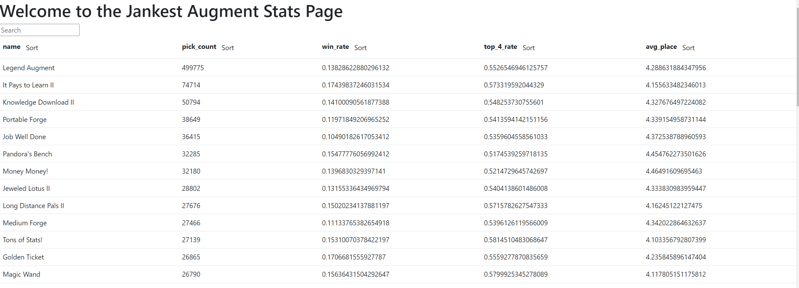

# TFT Stat Tracker

---

    <i>
An ugly screenshot of the page, still working on UI stuff
    </i>

---

Riot banned augment placement stats so I'm collecting them myself

Idk why nobody has a public repository about this so here it is. If this violates some sort of policy message me to take it down please.

I'm currently scraping lolchess because I can't be bothered enough to sign up for riot api. Maybe sometime in the future if I care enough I will transition over.

This is still heavily work in progress, use at your own risk

## QuickStart

1. Make sure you have docker
2. clone the repository using `git clone https://github.com/PookieBuns/tft_tracker.git`
3. run `docker compose up --build`
4. access locally via `localhost:20000`

## TODO

- [x] Add caching for augment, unit, and item id for better performance
- [ ] Add consumer / producer implementations for ETL
- [x] Add a scheduler
- [x] Add a status tracking for games so I don't rescrape them
- [x] Scrape more than just the first page
- [x] Change liscense to WTFPL
- [x] Add a frontend to actually be able to see the stats
- [ ] Make it look prettier
- [ ] Add a user search?
- [ ] Figure out how to deal with name changes (PUUID?)
